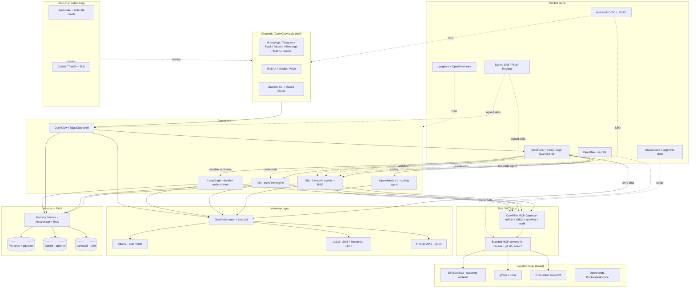

# Reference Architecture

ClawFirm is a layered system. From the user's perspective: a chat or voice surface that routes intelligently to the cheapest, most secure execution path that can satisfy the request.

## The diagram

## Layers explained

### Channels — the OpenClaw-style shell
A single multi-channel front end. Web UI, mobile, voice, and chat-app adapters (WhatsApp, Telegram, Slack, Discord, iMessage, Matrix, Teams). All channel adapters are **disabled by default** — the wizard turns them on one at a time with explicit user approval.

### Control plane
The cross-cutting services every other component depends on: identity (Authentik), secrets (OpenBao), approvals (ClawSecure + approval-shim), routing/policy (ClawRails + policy-judge), observability (Langfuse + OTel), and the signed skill/plugin registry.

### Data plane
The four engines that actually do work: **Dify** for visual low-code agents and RAG, **n8n** for SaaS-integration workflows, **LangGraph** for durable multi-step orchestration with checkpoints, and **OpenHands** for sandboxed coding work. The OpenClaw-style shell is the user-facing entry point that classifies the request and dispatches to one of these.

### Tool bus — MCP gateway
Every tool call from every engine flows through the in-house ClawFirm MCP gateway. The gateway enforces mTLS, OIDC identity, per-tool allowlists, per-agent egress rules, audit logging, and the MCP 2025-03-26 prohibition on token passthrough.

### Sandbox layer — tiered
Defense in depth: **DifySandbox** for known-language Python/Node code execution (seccomp whitelist); **gVisor** for arbitrary tools at SMB tier; **Firecracker microVM** for autonomous Tier 3 workloads at Enterprise tier. OpenHands' DockerWorkspace is reused as the coding-agent runtime.

### Inference layer
**ClawRails** sits in front of all model calls. It runs the local **policy-judge** (Qwen3.5-4B) to classify requests, then routes to local **Ollama** (single-user, low concurrency), local **vLLM** (multi-user, GPU), or **frontier APIs** (opt-in, gated by policy). EdgeClaw's empirical data suggests 60–80% of agent traffic can be served cheaply by local models.

### Memory + RAG
A single **Memory Service** exposes both EdgeClaw-style hierarchical memory (project / timeline / profile → fragment → conversation) and Dify-style flat RAG. Both representations are projections of an append-only event log, so we never have to reconcile two writable stores. Backed by **pgvector** (default), **Qdrant** (when scale or hybrid search demands it), or **LanceDB** (embedded, solo tier).

### Zero-trust networking
**Headscale** as the self-hosted control plane, standard Tailscale clients on every node. All inter-component traffic stays on the Tailscale overlay; only the ingress (Caddy or Traefik) exposes a TLS endpoint to the world.

---

## See also

- [`routing-logic.md`](./routing-logic.md) — how an incoming message is classified and dispatched.
- [`governance-ladder.md`](./governance-ladder.md) — the four-tier approval model.
- [`memory-service.md`](./memory-service.md) — the event-sourced memory design.
- [`../adr/`](../adr/) — architecture decision records that explain why each major choice was made.
